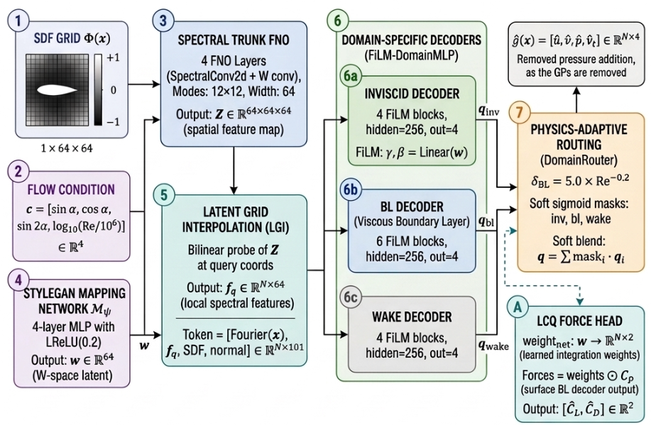

<div align="center">

# DD-RNO: Domain-Decomposed Routed Neural Operator for Airfoil Flow Prediction


[](https://arxiv.org/abs/2608.13490)
[](https://pytorch.org/)
[](https://www.python.org/)
[](LICENSE)
[](https://developer.nvidia.com/cuda-toolkit)

Official open-source implementation for **DD-RNO (Domain-Decomposed Routed Neural Operator)**, a physics-guided deep learning surrogate for high-fidelity RANS flow field prediction ($u_x, u_y, p, \nu_t$) and direct surface force integration ($C_L, C_D$) around arbitrary airfoil profiles.

[**Key Features**](#key-features) • [**Benchmark Results**](#benchmark-results) • [**Architecture**](#architecture) • [**Getting Started**](#getting-started) • [**Citation & Credits**](#citation--credits)

---

</div>

## Key Features

- **Physics-Guided Domain Routing**: Dynamically partitions the flow field into specialized regional decoders (*Inviscid*, *Boundary Layer*, *Wake*) routed via Reynolds-adaptive turbulent scaling ($\delta_{\text{BL}} \propto \text{Re}^{-1/5}$).
- **Learned Canonical Quadrature (LCQ)**: Replaces error-prone numerical summation with a flow-conditioned inner product, implicitly recovering total aerodynamic force ($C_L, C_D$) and viscous drag signals directly from continuous surface pressure fields.
- **Continuous SDF Geometry Trunk**: Combines a 2D Fourier Neural Operator (FNO) grid encoder with Latent Grid Interpolation (LGI) and Multi-Scale Fourier Features to resolve steep near-wall shear layers at sub-grid precision.
- **Instantaneous Mesh-Free Inference**: Evaluates complete flow fields and aerodynamic forces directly from raw `.dat` boundary files in **< 5 ms** (~$10,000\times$ faster than standard OpenFOAM RANS solvers).

---

## Benchmark Results

Evaluated on the standardized **AirfRANS** benchmark dataset ($N_{\text{train}}=800$, $N_{\text{test}}=200$ across 1,000 steady-state RANS simulations):

| Metric / Task | Baseline MLP | GraphSAGE | Graph U-Net | **DD-RNO (Ours)** | Improvement |
| :--- | :---: | :---: | :---: | :---: | :---: |
| **Velocity $u_x$ MSE** ($\times 10^{-2}$) | $1.58$ | $1.72$ | $1.68$ | **$0.091$** | **$17.4\times$ Lower Error** |
| **Reynolds OOD $u_x$ MSE** ($\times 10^{-2}$) | $10.20$ | $10.80$ | $10.50$ | **$0.448$** | **$22.8\times$ Lower Error** |
| **Drag $C_D$ Relative Error (%)** | $6.18\%$ | $7.37\%$ | $13.32\%$ | **$1.09\%$** | **$5.7\times$ Error Reduction** |
| **Drag Rank Correlation ($\rho_D$)** | $0.250$ | $0.194$ | $0.092$ | **$0.997$** | **Near-Perfect ($\rho \to 1.0$)** |
| **Inference Speed** | ~10 min/sim | ~5 min/sim | ~5 min/sim | **< 5 ms** | **$10,000\times$ Speedup** |

---

## Architecture

The end-to-end DD-RNO architecture maps Signed Distance Fields (SDF) and flow conditions $(\alpha, \text{Re})$ into continuous volumetric flow fields and integrated force coefficients ($C_L, C_D$):

<p align="center">
  
</p>

---

## Getting Started

### 1. Installation
Clone the repository and install dependencies in a Python 3.10+ environment:
```bash
git clone https://github.com/taksh2406/DD-RNO.git
cd DD-RNO
pip install -r requirements.txt
```

### 2. Quickstart Inference
Predict aerodynamic coefficients and flow fields directly from a raw `.dat` file:
```bash
python example_inference.py
```

### 3. Python API Usage
```python
from inference.predict import DDRNOPredictor

# Initialize predictor with pre-trained checkpoint and config
predictor = DDRNOPredictor("checkpoints/ddrno/best_cl.pt", "configs/ddrno.yaml")

# Predict Cl and Cd directly from a .dat airfoil file (NACA 0012 at alpha = 5 deg, Re = 3M)
result = predictor.predict_from_dat("naca0012.dat", aoa_deg=5.0, re=3e6)
print(f"Cl = {result['Cl']:.4f}, Cd = {result['Cd']:.5f}")
# Output: Cl = 0.4933, Cd = 0.01030

# Query continuous flow fields (ux, uy, p, nut) at arbitrary physical coordinates (x, y)
import numpy as np
query_points = np.array([[0.5, 0.1], [0.5, 0.0], [1.2, 0.0]])
res = predictor.predict_from_dat("naca0012.dat", aoa_deg=5.0, re=3e6, query_pts=query_points, return_field=True)
print("Flow fields shape:", res['field'].shape)  # (3, 4) -> [ux, uy, p, nut]
```

### 4. Training & Evaluation
To train DD-RNO from scratch on the Full task split:
```bash
python training/main_train.py --config configs/ddrno.yaml --seed 42
```

To evaluate a trained model checkpoint on the test split:
```bash
python evaluation/eval_full_mesh.py --ckpt checkpoints/ddrno/best_cl.pt --config configs/ddrno.yaml --split test
```

---

## Citation & Credits

If you use this work or codebase in your research, please credit:

> **T.A. Mehta, P.S. Bhati, and H.D. Akolekar**, *"DD-RNO: A Domain-Decomposed Routed Neural Operator for Airfoil Flow Prediction"*.  
> **Paper Link**: [https://arxiv.org/abs/2608.13490](https://arxiv.org/abs/2608.13490)

```bibtex
@article{mehta2026ddrno,
  title={DD-RNO: A Domain-Decomposed Routed Neural Operator for Airfoil Flow Prediction},
  author={Mehta, T. A. and Bhati, P. S. and Akolekar, H. D.},
  journal={arXiv preprint arXiv:2608.13490},
  year={2026},
  url={https://arxiv.org/abs/2608.13490}
}
```

---

## License

This project is open-source and licensed under the **[MIT License](LICENSE)**.
